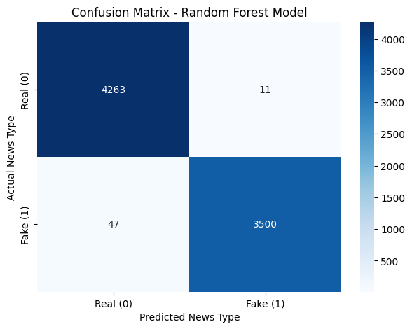
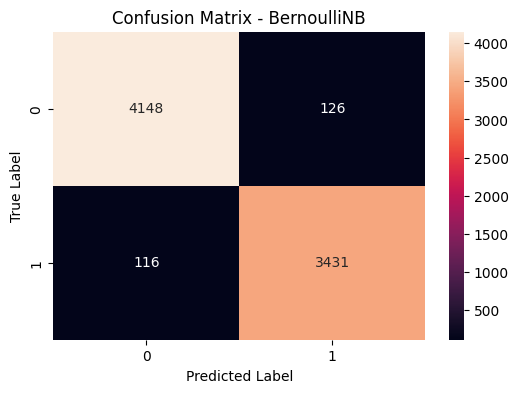

# Fake News Detection

## Overview

This project ingests a labeled dataset of true and fake news articles, cleans and normalizes the text through a custom preprocessing pipeline, vectorizes the content using two separate strategies, and trains and evaluates two classifiers side by side.

The core idea is straightforward: given the headline and body of a news article, can a model reliably determine whether it is genuine reporting or fabricated content?


---

## Pipeline

```
Raw CSVs (True.csv / Fake.csv)
        |
        v
Label & merge -> shuffle -> combine title + text into single content field
        |
        v
Text preprocessing
  - lowercase
  - currency normalization  ($5.5M -> "dollar")
  - punctuation removal
  - number generalization   (1984 -> "number")
  - stop word removal       (preserving "no", "not", "never")
  - Porter stemming
        |
        v
Train / test split (80/20)
        |
       / \
      /   \
  BoW     TF-IDF
(5000)   (5000)
    |       |
    v       v
BernoulliNB  RandomForest
 (alpha=0.01) (100 trees, max_depth=20)
```

---

## Dataset

We are using the **Fake News Dataset** for this project.

* **Link to Dataset:** *[[Data](https://drive.google.com/drive/folders/1AS1VVQ6P7CSQJGoHNSb3sQx8bIFSmR9I?usp=drive_link)]*

The notebook expects two CSVs placed at `../data/`:

| File | Contents |
|---|---|
| `True.csv` | Verified real news articles |
| `Fake.csv` | Fabricated/misinformation articles |

Each CSV contains `title`, `text`, `subject`, and `date` columns. Labels are assigned programmatically: `0` for real, `1` for fake.

## Getting Started for the Team

**1. Clone the repository**

```bash
git clone https://github.com/Mohamed-Ahmed285/fake-news-classifier.git
cd fake-news-classifier
```

**2. Install dependencies**
Install all required packages (Pandas, Scikit-learn, NLTK, etc.) using the provided requirements file:

```bash
pip install -r requirements.txt
```

**Requirments**
```
numpy
pandas
scikit-learn
tensorflow
nltk
plotly
matplotlib
seaborn
```

You will also need the NLTK Porter Stemmer data:

```python
import nltk
nltk.download('punkt')
```

---

## Project Structure

```
.
├── Code.ipynb        # Main notebook
├── img/
│   ├── ConfusionMatrix-RF.png
│   └── ConfusionMatrix-BNB.png
└── data/
    ├── True.csv
    └── Fake.csv

```

---

## Models

**Random Forest + TF-IDF**

A 100-tree forest with a maximum depth of 20, trained on TF-IDF weighted features. TF-IDF rewards terms that are distinctive to individual articles rather than common across the corpus, which tends to work well when the vocabulary of fake vs. real news differs meaningfully.

**Bernoulli Naive Bayes + Bag of Words**

A BernoulliNB model with alpha smoothing of 0.01, trained on binary BoW presence features. Because the preprocessing pipeline aggressively normalizes text (stemming, stop word removal, number generalization), word presence carries more signal than raw frequency — making the Bernoulli assumption a reasonable fit here.

---

## Results
 
Evaluated on an 80/20 train/test split. Both models output full classification reports and confusion matrix heatmaps inside the notebook.
 
| Model | Accuracy | Precision | Recall | F1 Score |
|---|---|---|---|---|
| Random Forest + TF-IDF | 99% | 99% | 99% | 99% |
| Bernoulli Naive Bayes + BoW | 97% | 97% | 97% | 97% |
 
**Per-class breakdown**
 
Random Forest + TF-IDF (test set: 7,821 articles):
| Class | Precision | Recall | F1 | Support |
|---|---|---|---|---|
| Real (0) | 0.99 | 1.00 | 0.99 | 4,274 |
| Fake (1) | 1.00 | 0.99 | 0.99 | 3,547 |
 
Bernoulli Naive Bayes + BoW (test set: 7,821 articles):
| Class | Precision | Recall | F1 | Support |
|---|---|---|---|---|
| Real (0) | 0.97 | 0.97 | 0.97 | 4,274 |
| Fake (1) | 0.96 | 0.97 | 0.97 | 3,547 |
 
**Key observations:**
 
- Random Forest + TF-IDF is the stronger model, achieving near-perfect scores across both classes with virtually no false negatives on real news
- BernoulliNB is no slouch at 97% and trains in a fraction of the time, making it a strong baseline for the task
- Both models generalise well across classes, with balanced precision and recall indicating no meaningful bias toward either label

### Random Forest + TF-IDF


### Bernoulli Naive Bayes + BoW

